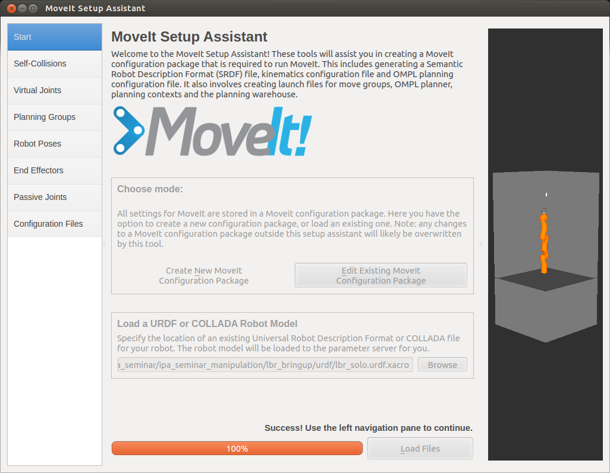

<a id="top"/> 
# Motion Planning with ROS
## Tutorial

### Contents

1. <a href="#1--introduction">Introduction</a>   
  1.1. <a href="#11-tools">Tools</a>  
  1.2. <a href="#12-helpful-commands">Helpful Commands</a>  
2. <a href="#2-moveit---setup-assistant">MoveIt! - Setup Assistant</a>  
  2.1. <a href="#21-start">Start</a>  
  2.2. <a href="#22-self-collision">Self-Collision</a>  
  2.3. <a href="#23-virtual-joints">Virtual Joints</a>  
  2.4. <a href="#24-planning-groups">Planning Groups</a>  
  2.5. <a href="#25-robot-poses">Robot Poses</a>  
  2.6. <a href="#26-end-effectors">End Effectors</a>  
  2.7. <a href="#27-passive-joints">Passive Joints</a>  
  2.8. <a href="#28-configuration-files">Configuration Files</a>  
  2.9. <a href="#29-summary">Summary</a>  
3. <a href="#3-moveit---rviz-plugin">MoveIt! - RVIZ-Plugin</a>  
  3.1. <a href="#31-plugin-environment-basics">Plugin Environment Basics</a>  
  3.2. <a href="#32-planning-request">Planning Request</a>  
4. <a href="#4-moveit---enhanced-configuration">MoveIt! - Enhanced Configuration</a>  
  4.1. <a href="#41-perception">Perception</a>  
  4.2. <a href="#42-control">Control</a>  
  4.3. <a href="#43-enhanced-usage">Enhanced Usage</a>  
5. <a href="#5-moveit---commandline-tool">MoveIt! - CommandLine Tool</a>  
6. <a href="#6-moveit---scripting-api">MoveIt! - Scripting API</a>  
  6.1. <a href="#61-planningsceneinterface">PlanningSceneInterface</a>  
  6.2. <a href="#62-movegroupcommander">MoveGroupCommander</a>  
  6.3. <a href="#63-script-execution">Script-Execution</a>  
7. <a href="#7-help">Help</a>  


### 1.  Introduction

This section quickly introduces basic tools used within this tutorial.  
It also lists several helpful (terminal) commands that are used frequently throughout this tutorial.  

#### 1.1. Tools  

It is recomended to use `terminator` as a command prompt. You can find a shortcut on the left bar of your screen. Commands given in the following can be copied into the `terminator` window. During the tutorial sometimes several terminal windows are needed. The terminal can be split into several sub-windows by using the __Split Horizontically/Vertically__ feature after a right-click on the `terminator` window.  

We wil use `gedit` as a text edior. You can find a shortcut on the left bar of your screen as well. The editor can also be opened by running `gedit` in a terminal window.  

#### 1.2. Helpful Commands

For navigating to specific ROS packages or files, the easiest way to do so is to use the command `roscd <package_name>` where `<package_name>` is the name of the ROS package you want to navigate to, e.g. `lbr_bringup`.  `roscd` brings you to the desired package from any previous location. After the `<package_name>`, pressing `TAB` can be used for auto-completion in order to navigate further within the ROS package.  

For editing a file simply use `roscd` to navigate to the folder of the file and then type `gedit <file_name>` where `<file_name>` is the name of the file you want to edit.  

For more helpful ROS commands have a look at the [ROS Cheat Sheet](http://download.ros.org/downloads/ROScheatsheet.pdf "ROS Cheat Sheet").  

For convenience, all required ROS packages are already installed and the environment (i.e. environment variables) is set up correctly. Whenever an environment variable (e.g. ROS_MASTER_URI) needs to be changed this is stated below.  

Also, an example solution for this tutorial is already available. Whenever you want to have a look at the solution files or you want to run the solution, simply type `solution` in the terminal before opening the requested file or running the respective command.  

<a href="#top">top</a> 


### 2. MoveIt! - Setup Assistant  

MoveIt! requires a little  configuration before offering its capabilities to your robot. The configuration can easily be done with the MoveIt! Setup Assistant - a graphical tool that comes shipped with MoveIt! automatically.

The following steps will lead you to a valid MoveIt!-configuration for the KUKA LBR.  

#### 2.1. Start  

To start the MoveIt-SetupAssistant GUI, run: 
```
roslaunch moveit_setup_assistant setup_assistant.launch
```
You should see the screen below.


As we are creating the configuration for the first time, select "Create New MoveIt Configuration Package".  
Now we need to load the robot model (URDF) on which basis the configuration is generated.  
Browse to `~/git/ipa_seminar/ipa_seminar_manipulation/lbr_bringup/urdf` and load the `lbr_solo.urdf.xacro` file.  
You should now see our robot within the SetupAssistant.  




#### 2.2. Self-Collision  

In order to speed up later collision checking, a _SelfCollisionMatrix_ can be computed in the next tap ("Self Collision").  
Select the highest _Sampling Density_ and click "Regenerate Default Collision Matrix".  


After about 10 seconds you will see a list of pairs of links which never or always collide within the robot model. This knowledge is used to speed up Self-CollisionChecking as these checks need not to be done during a planning step again.


#### 2.3. Virtual Joints  

The next tap "Virtual Joints" is less important for our scenario.  
This tap gets important in case you want to use MoveIt! with a mobile robot. A _virtual joint_ connects the robot to the world. While 
