<a id="top"/> 
# Motion Planning with ROS
## Tutorial

### Contents

1. <a href="#1--introduction">Introduction</a>   
  1.1. <a href="#11-tools">Tools</a>  
  1.2. <a href="#12-helpful-commands">Helpful Commands</a>  
2. <a href="#2-moveit---setup-assistant">MoveIt! - Setup Assistant</a>  
  2.1. <a href="#21-start">Start</a>  
  2.2. <a href="#22-self-collision">Self-Collision</a>  
  2.3. <a href="#23-virtual-joints">Virtual Joints</a>  
  2.4. <a href="#24-planning-groups">Planning Groups</a>  
  2.5. <a href="#25-robot-poses">Robot Poses</a>  
  2.6. <a href="#26-end-effectors">End Effectors</a>  
  2.7. <a href="#27-passive-joints">Passive Joints</a>  
  2.8. <a href="#28-configuration-files">Configuration Files</a>  
  2.9. <a href="#29-summary">Summary</a>  
3. <a href="#3-moveit---rviz-plugin">MoveIt! - RVIZ-Plugin</a>  
  3.1. <a href="#31-plugin-environment-basics">Plugin Environment Basics</a>  
  3.2. <a href="#32-planning-request">Planning Request</a>  
4. <a href="#4-moveit---enhanced-configuration">MoveIt! - Enhanced Configuration</a>  
  4.1. <a href="#41-perception">Perception</a>  
  4.2. <a href="#42-control">Control</a>  
  4.3. <a href="#43-enhanced-usage">Enhanced Usage</a>  
5. <a href="#5-moveit---commandline-tool">MoveIt! - CommandLine Tool</a>  
6. <a href="#6-moveit---scripting-api">MoveIt! - Scripting API</a>  
  6.1. <a href="#61-planningsceneinterface">PlanningSceneInterface</a>  
  6.2. <a href="#62-movegroupcommander">MoveGroupCommander</a>  
  6.3. <a href="#63-script-execution">Script-Execution</a>  
7. <a href="#7-help">Help</a>  


### 1.  Introduction

This section quickly introduces basic tools used within this tutorial.  
It also lists several helpful (terminal) commands that are used frequently throughout this tutorial.  

#### 1.1. Tools  

We use _Terminator_ as a command prompt. You can find a shortcut on the left bar of your screen. Commands given in the following can be copied into the _Terminator_ window. During the tutorial sometimes several terminal windows are needed. The terminal can be split into several sub-windows by using the _Split Horizontically/Vertically_ feature after a right-click on the _Terminator_ window.  

We wil use _gedit_ as a text edior. You can find a shortcut on the left bar of your screen as well. The editor can also be opened by running `gedit` in a terminal window.  

#### 1.2. Helpful Commands

For navigating to specific ROS packages or files, the easiest way to do so is to use the command `roscd <package_name>` where `<package_name>` is the name of the ROS package you want to navigate to, e.g. `lbr_bringup`.  `roscd` brings you to the desired package from any previous location. After the `<package_name>`, pressing `TAB` can be used for auto-completion in order to navigate further within the ROS package.  

For editing a file simply use `roscd` to navigate to the folder of the file and then type `gedit <file_name>` where `<file_name>` is the name of the file you want to edit.  

For more helpful ROS commands have a look at the [ROS Cheat Sheet](http://download.ros.org/downloads/ROScheatsheet.pdf "ROS Cheat Sheet").  

For convenience, all required ROS packages are already installed and the environment (i.e. environment variables) is set up correctly. Whenever an environment variable (e.g. ROS_MASTER_URI) needs to be changed this is stated below.  

Also, an example solution for this tutorial is already available. Whenever you want to have a look at the solution files or you want to run the solution, simply type `solution` in the terminal before opening the respective file or running the command.  

<a href="#top">top</a> 


### 2. MoveIt! - Setup Assistant  

MoveIt! requires a little  configuration before offering its capabilities to your robot. The configuration can easily be done with the MoveIt! Setup Assistant - a graphical tool that comes shipped with MoveIt! automatically.

The following steps will lead you to a valid MoveIt!-configuration for the KUKA LBR.  

#### 2.1. Start  

To start the MoveIt-SetupAssistant GUI, run: 
```
roslaunch moveit_setup_assistant setup_assistant.launch
```
You should see the screen below.

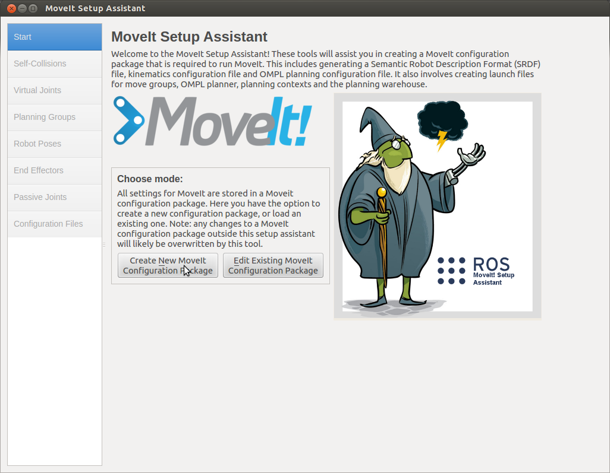

As we are creating the configuration for the first time, select "Create New MoveIt Configuration Package".  
Now we need to load the robot model (URDF) on which basis the configuration is generated.  
Browse to `~/git/ipa_seminar/ipa_seminar_manipulation/lbr_bringup/urdf` and load the `lbr_solo.urdf.xacro` file.  
You should now see our robot within the SetupAssistant.  


#### 2.2. Self-Collision  

In order to speed up later collision checking, a _SelfCollisionMatrix_ can be computed in the next tap ("Self Collision").  
Select the highest _Sampling Density_ and click "Regenerate Default Collision Matrix".  

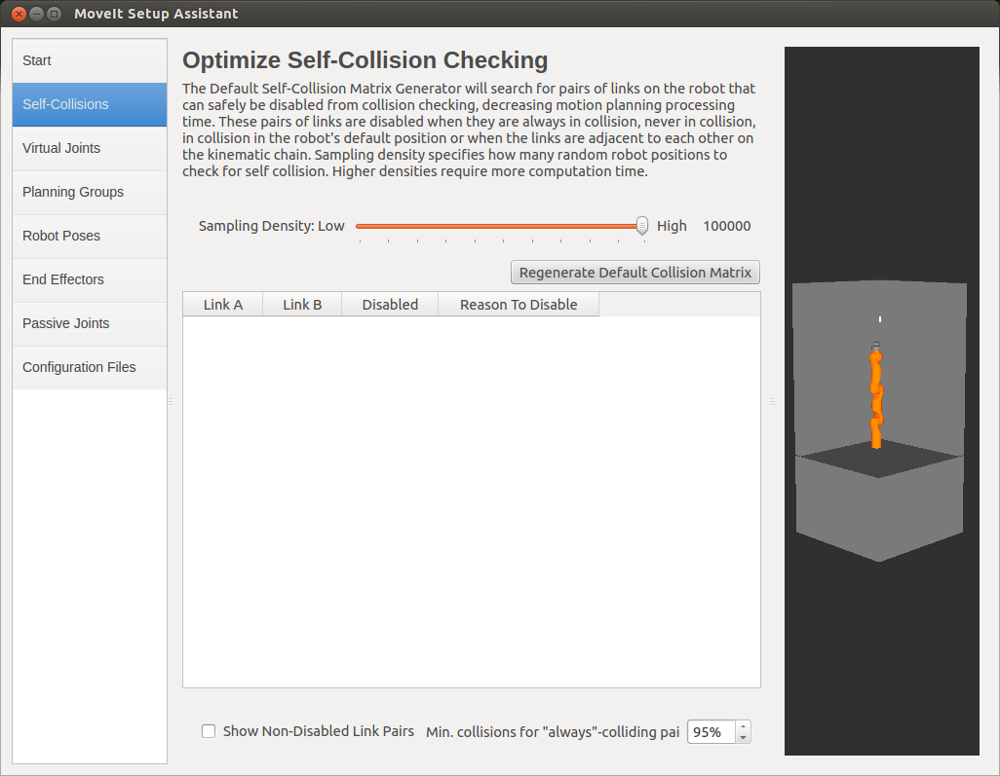

After about 10 seconds you will see a list of pairs of links which never or always collide within the robot model. This knowledge is used to speed up Self-CollisionChecking as these checks need not to be done during a planning step again.

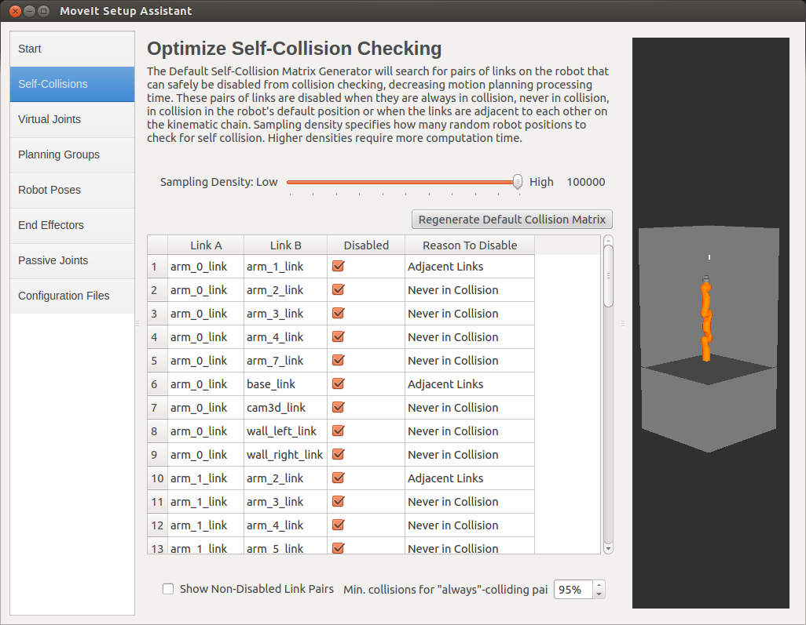


#### 2.3. Virtual Joints  

The next tap "Virtual Joints" is less important for our scenario.  
This tap gets important in case you want to use MoveIt! with a mobile robot. A _virtual joint_ connects the robot to the world. While mobile robots would have _planar_ (2d) or _floating_ (6d) virtual joints, we simply define a _fixed_ virtual joint stating that our robot does not move.  

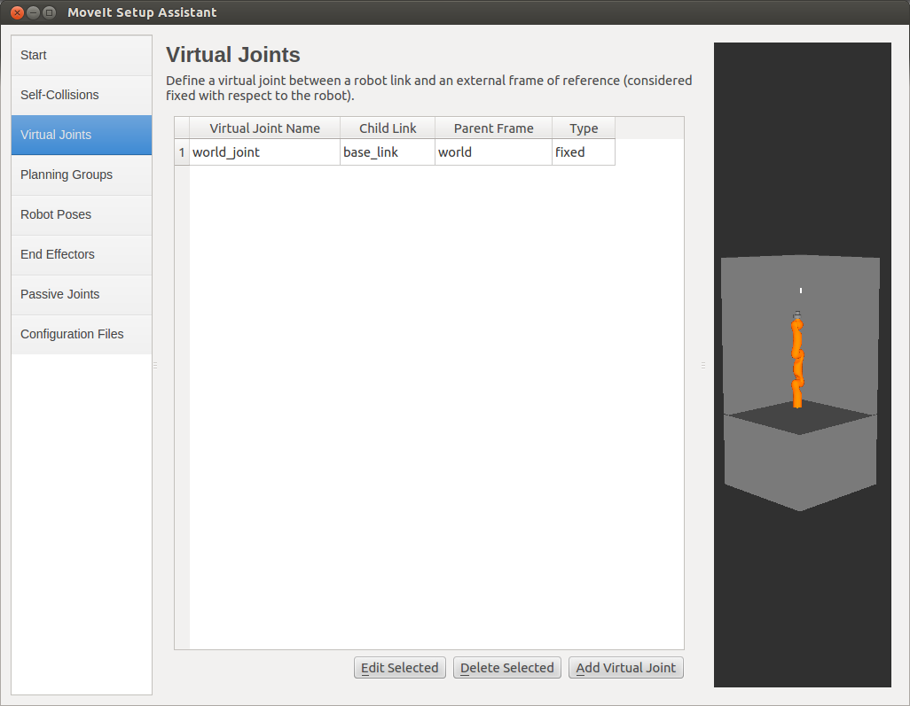

#### 2.4. Planning Groups  

In step four ("Planning Groups") we define collections of links and joints of the robot and declare them as _Planning Groups_. Each Planning Group defines semantically related parts of the robot. For each Planning Group defined here MoveIt! will generate a configuration in order to perform motion planning later.  

For this tutorial we add two Planning Groups:  

1. Group "arm"  
  * Select `kdl_kinematics_plugin/KDLKinematicsPlugin` as _Kinematic Solver_. This is a numerical Solver for Inverse Kinematics.  
  * Use the _Add Kin. Chain_ option to assign the kinematic chain starting with _arm_0_link_ (Base Link) and ending with _arm_7_link_ (Tip Link).  

2. Group "gripper"  
  * For the gripper does not need a kinematic solver. Thus we leave it `None`.  
  * As the gripper group only consists of just one link (i.e. _gripper_link_), we use the _Add Links_ option for assigning.  

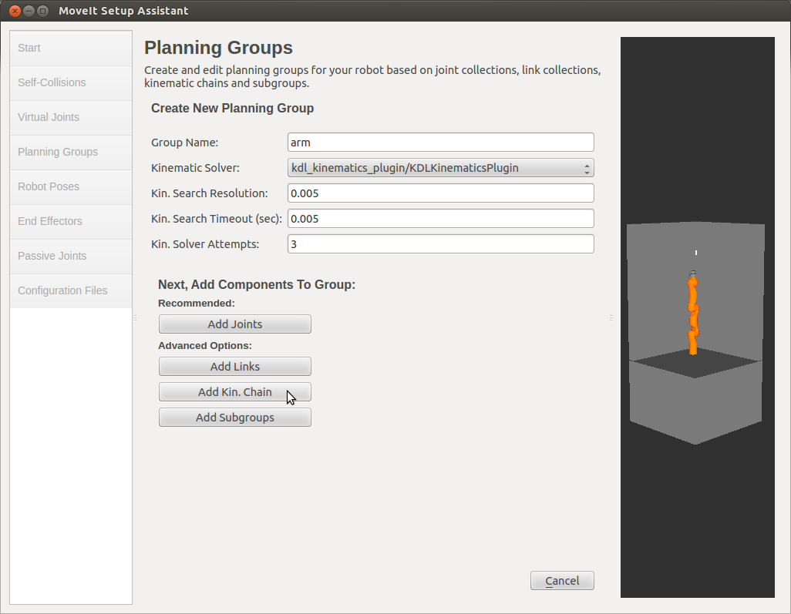  

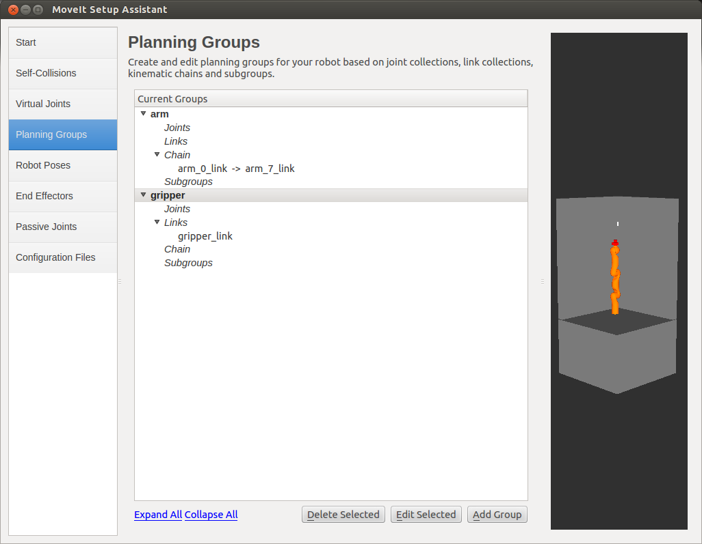

#### 2.5. Robot Poses  

The tap "Robot Poses" allows us to define some _robot poses_. These robot poses can later be used as goals for a motion plan within the RVIZ plugin or the CommandLineTool.  
Now define some poses for the group "arm". Use the sliders to set the joint values of each joint within the group.  
In the view you can see what the current configuration would look like. In case the current configuration is in collision a notification is displayed.  

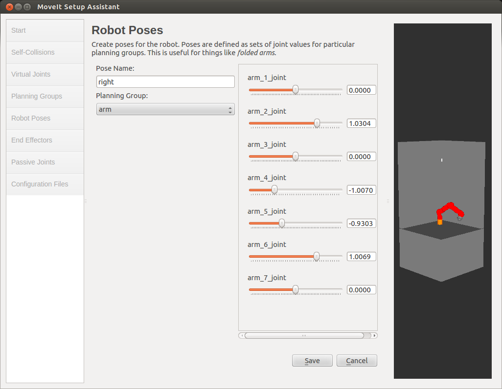

Create at least a robot pose `left` and a robot pose `right` as those are going to be used lateron.  


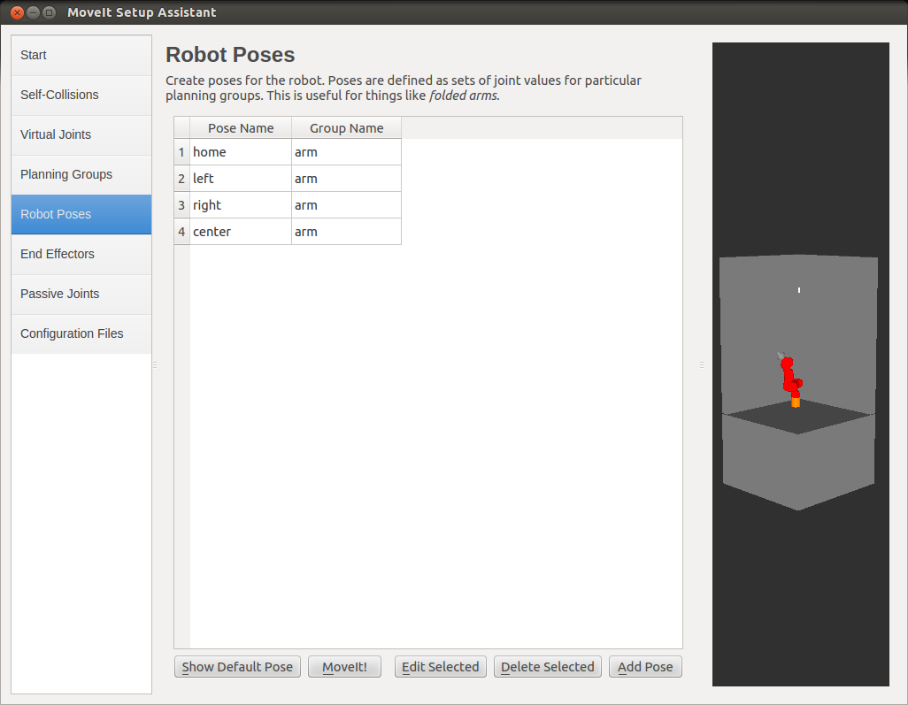
#### 2.6. End Effectors  

Next, we define our gripper to be the _End Effector_ for our arm.  
This will give us an _Interactive Marker_ for moving the arm in the RVIZ Plugin. This is also important for High(er)-Level Capabilities of MoveIt! - such as _Pick-and-Place_.  

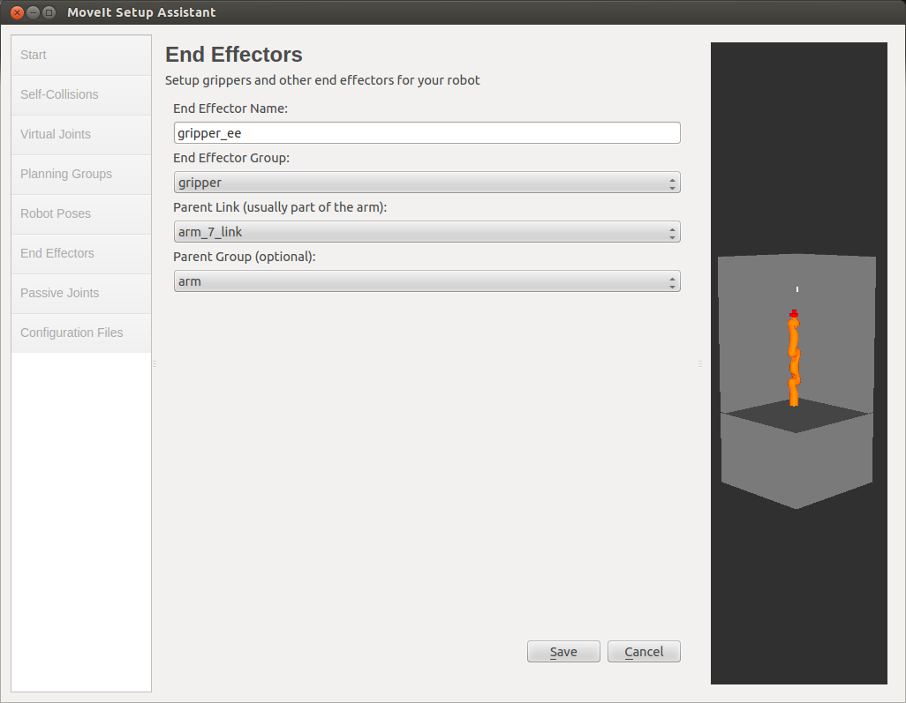

#### 2.7. Passive Joints  

This tap ("Passive Joints") is not relevant for our scenario. So we can just skip it.

#### 2.8. Configuration Files  

In the final step, the MoveIt! SetupAssistant generates all files required for MotionPlanning for us automatically.  
You can see a list of the files to be generated below. It comprises configuration files as well as startup files. By clicking on a file you can get some explanation about it in the text box beside it.  

The only thing we need to do is to specify a location where the files should be stored. Browse to the folder `~/git/ipa_seminar/ipa_seminar_manipulation` and create a new folder `lbr_moveit_config` there. This is the destination for the configuration files. Then press _Generate Package_.  

After the files have been generated, we can click _Exit Setup Assistant_.

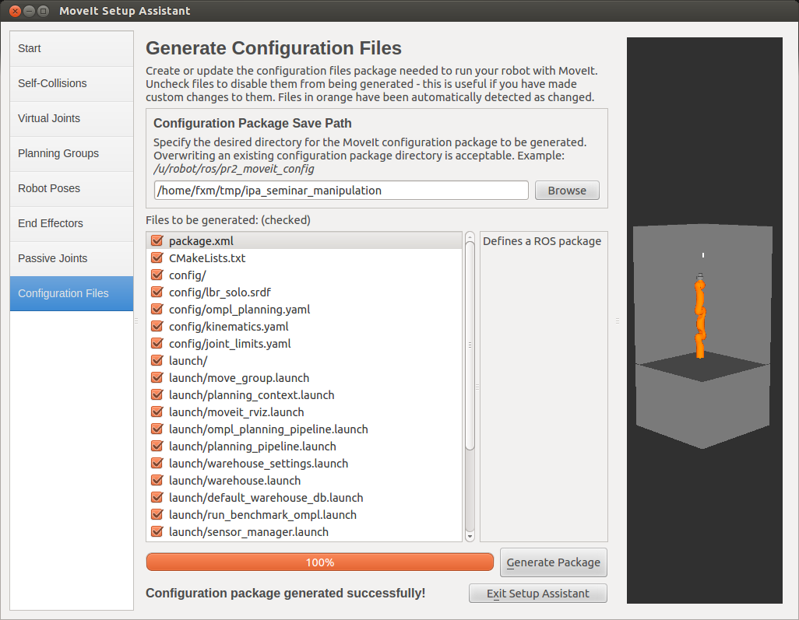


#### 2.9 Summary  

We now created a MoveIt! configuration package that provides us with all configuration files and basic startup files.  
Navigate to the package with `roscd lbr_moveit_config` and have a look at the generated files.  

The package includes the following files (amongst others):  

Configuration files:  
* __config/joint_limits.yaml__: This file specifies velocity and acceleration limits for all joints of the robot. Position limits are defined in the URDF already.
* __config/kinematics.yaml__: This file specifies the kinematic solvers to be used with each group.
* __config/ompl_planning.yaml__: This file specifies a set of several (sampling-based) motion planner from the OMPL motion library with according default settings.
* __config/lbr_solo.srdf__: This SRDF (Semantic Robot Description Format) file holds the main configuration to be used with MoveIt!

Startup files:  
* __launch/demo.launch__: This is the most basic startup file. It opens RVIZ where the planning capability can be tested without needing to run either a simulation or a robot hardware.
* __launch/move_group.launch__: This file will be used when MoveIt! is to be used in connection with a simulation or a robot hardware

Both of these launch files combine other launch files contained in the launch folder. Those other files start up a specific module for MoveIt! respectively.  

Whenever something needs to be changed within the MoveIt! configuration package, the Setup Assistant can simply be run again with the already existing package being loaded instead of creating a new package. Running the Setup Assistant again will only update files where changes apply.  

The configuration files can also be modified manually. In fact, we will do so during the remainder of this tutorial.  
In such case the Setup Assistant will notify you that configuration files have been edited outside the Setup Assistant.  

<a href="#top">top</a> 


### 3. MoveIt! - RVIZ-Plugin  

The following will explain the main important points about the MoveIt! RVIZ Plugin.  
A PR2-specific tutorial can be found [here](http://moveit.ros.org/wiki/PR2/Rviz_Plugin/Quick_Start).  

#### 3.1. Plugin Environment Basics  

In order to get familar with MoveIt! step-by-step, we will first use MoveIt! in its most basic form:
```
roslaunch lbr_moveit_config demo.launch config:=true
```

This will start up the main MoveIt! node called _move_group_ and an RVIZ window with the MoveIt!-Plugin loaded.  

__ToDo: Screenshot of original RVIZ config - annotated!!!__  

The window consists of three main parts:  
* On the right you can see a visualization of the robot augmented with various additional (virtual) information.
* Within the _Displays_ section additional plugins can be added, removed or configured.
* On the lower left you can see the MoveIt! control panel. 

#### 3.2. Planning Request  

Get used with the RVIZ environment and the plugins by:
* Move between pre-defined robot poses
* Move using Start-/Goal-InteractiveMarker
* Configure your visualization as you like (e.g. show trail)

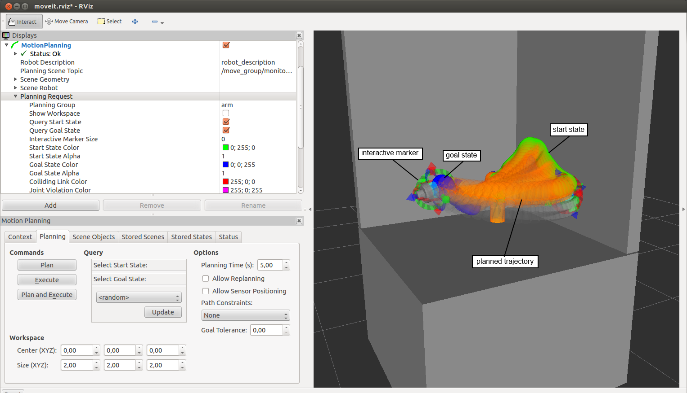

<a href="#top">top</a> 


### 4. MoveIt! - Enhanced Configuration  

In this step we will enhance the basic MoveIt! configuration generated in step 3.  
We will add support for visual sensors to be able to consider the dynamic environment during collision checking.  
Also we will add controllers that allow us to use MoveIt! with the real robot hardware. 

#### 4.1 Perception  

Out of the box, MoveIt! considers the robot model's own geometric model (URDF) during collision checking to prevent self-collision.  
Also, (known) static obstacles given as geometric primitives (i.e. box, cylinder, sphere) or meshes (i.e. from CAD data) can be added to the _Planning Scene_ at runtime. This will be shown in the last chapter of this tutorial ("Scripting API").  
As in most real world scenarios, the environment is not completely known, it changes over time or simply cannot be modeled accurately. Then visual sensors can be used to detect the current scene.  

MoveIt! uses a concept called _Planning Scene_ to provide information about an environment situation. The Planning Scene combines the following information:  
* __Robot State:__ The state of the robot, i.e. its joint configuration
* __Collision Objects:__ A set of (known) collision objects. A collision object is defined by its geometry and its pose
* __Visual Information:__ Information retrieved from a visual sensor

The following image gives an overview of the Planning Scene concept.  


Now, in order to consider visual information within the Planning Scene, we need to specify on which ROS topics such sensor information can be received. Therefore we will add a new configuration file within the lbr_moveit_config that specifies all required information.

Create a new file `sensor_kinect.yaml` with the following content and save it in `lbr_moveit_config/config`.  
```
sensors:
  - sensor_plugin: occupancy_map_monitor/PointCloudOctomapUpdater
    point_cloud_topic: /cam3d/depth/points
    max_range: 2.0
    point_subsample: 1
    shape_padding: 0.05
    shape_scale: 1.0
```

In order to use this new configuration file, we will add the following to `lbr_solo_moveit_sensor_manager.launch` in `lbr_moveit_config/launch`:  
```
<launch>
  <param name="octomap_frame" type="string" value="base_link" />
  <param name="octomap_resolution" type="double" value="0.05" />
  <param name="max_range" type="double" value="2.0" />
  <rosparam file="$(find lbr_moveit_config)/config/sensor_kinect.yaml"/>
</launch>
```

This tells MoveIt! to load an additional plugin (i.e. _sensor_plugin_) during startup. The configuration for this new plugin is given by the yaml file. 

#### 4.2 Control  

In order to be able to use MoveIt! with a real robot hardware we need to tell MoveIt!:  
1. where from it can receive information about the robot's current configuration (i.e. the joint states)  
2. where the planned trajectory should be executed  

Both of this can be achieved by configuring an according controller for our KUKA LBR.

Therefore, we create a new file `controllers.yaml` with the following content and save it in `lbr_moveit_config/config`.  
```
controller_list:
  - name: arm_controller
    ns: follow_joint_trajectory
    default: true
    joints:
      - arm_1_joint
      - arm_2_joint
      - arm_3_joint
      - arm_4_joint
      - arm_5_joint
      - arm_6_joint
      - arm_7_joint
```

In order to use this new configuration file, we will add the following to `lbr_solo_moveit_controller_manager.launch` in `lbr_moveit_config/launch`:  
```
<launch>
  <rosparam file="$(find lbr_moveit_config)/config/controllers.yaml"/>
  <param name="use_controller_manager" value="false"/>
  <param name="trajectory_execution/execution_duration_monitoring" value="false"/>
  <param name="moveit_controller_manager" value="pr2_moveit_controller_manager/Pr2MoveItControllerManager"/>
</launch>
```

More about the concept of executing trajectories with MoveIt! can be found [here](http://moveit.ros.org/wiki/Executing_Trajectories_with_MoveIt! "ExecuteTrajectories").  

#### 4.3 Enhanced Usage  

Finally, we have all together to use MoveIt! on our KUKA LBR!  
We will use the MoveIt! RVIZ-Plugin again to experience the new capabilities we just configured.  


 CAUTION ZONE   
* Only use the robot under supervision of your tutor
* Make sure you have a clear view to the robot and the emergency button is in your hands before executing a command 
* In case of unexpected behavior or in case the robot is about to collide hit the emergency button immediately
* After the emergency button has been pressed, ask your tutor to recover the robot

__ToDo: call robot alias?__  


In order to work with the real robot hardware lateron, the robot needs to be initialized first. Ask your tutor to do so.  
Then, simply run:
```
roslaunch lbr_bringup robot.launch
```
This will start up all necessary drivers.  

<a href="#top">top</a> 


Bring up the robot as descriped in section 1.2.
```
roslaunch lbr_bringup robot.launch
```
Next we will start MoveIt! with the new capabilities by running (in new terminal):
```
roslaunch lbr_moveit_config move_group.launch
```
And to start RVIZ (in new terminal):
```
roslaunch lbr_moveit_config moveit_rviz.launch
```

We will see our robot in its current Planning Scene. 

__ToDo: Screenshot RVIZ with real robot and CollisionMap - annotated!__

As in the previous step we can compose Planning Requests in RVIZ using the InteractiveMarkers or move to pre-defined robot poses.  
Once you composed a new Planning Request, click _Plan_ in the control panel of the plugin. MoveIt! starts to solve your request and - if successfull - you should see the resulting trajectory.  

 CAUTION ZONE   

The resulting trajectory can be executed on the robot by clicking _Execute_ in the control panel.  

By clicking _Plan and Execute_, MoveIt! will directly execute your Planning Request - if planned successfully.  
When using this mode - ___only in this mode!___ - also _reactive_ planning is activated. This means that MoveIt! monitors the execution of the trajectory, updating the Planning Scene continuously. As soon as changes in the environment, e.g. a new obstacle, crosses the trajectory thus leading to a collision, MoveIt! stops the execution and tries to replan, i.e. find another trajectory to the specified goal considering the new environment situation.  

<a href="#top">top</a> 


### 5. MoveIt! - CommandLine Tool  

Another possibility for quickly sending planning problems to MoveIt! and execute them either in simulation or on a real robot is provided through the MoveIt! - CommandLine Tool. This terminal-based interface provides MoveIt!'s capabilities by using the MoveIt! Python API (more details in next section).  

To start the CommandLine Tool run:
```
rosrun moveit_commander moveit_commander_cmdline.py
```
This changes the look of you terminal to the following prompt.

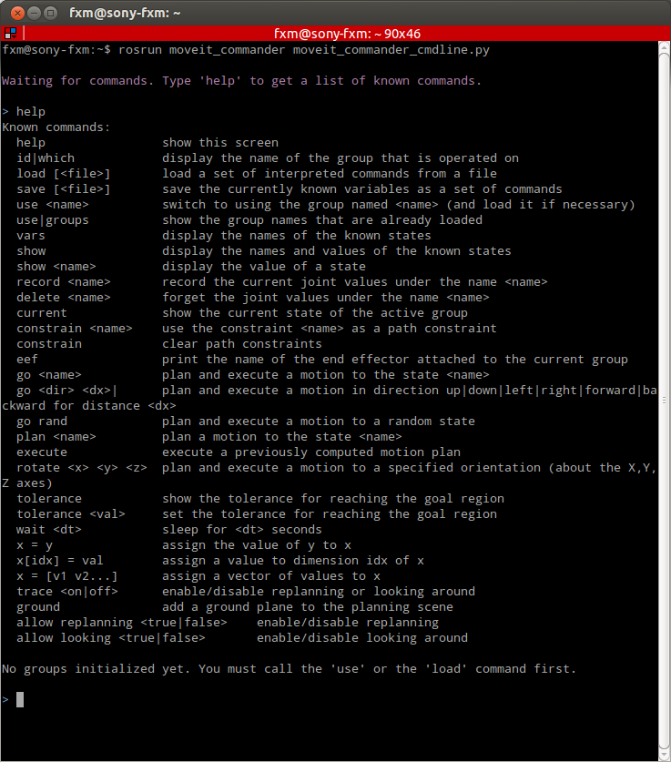

First, we specify which group we would like to work with by typing:
```
use arm
```
Next we can move to one of the pre-defined robot poses by typing: 
```
go <name_of_robot_pose>
```
If we would like to see whether a plan can be found without execution, we can do this by typing:
```
plan <name_of_robot_pose>
```
The last trajectory can later be executed by typing:
```
execute
```

There are more helpfull commands within the CommandLine Tool. A complete list can be seen by typing:
```
help
```

Get familar with the CommandLine Tool by also using:  
* `current` show the current state of the active group
* `record <name>` record the current joint values under the name <name>. <name> can then be used as any other pre-defined robot pose.
* `show` display the names and values of the known states
* `go <dir> <dx>` plan and execute a motion in direction up|down|left|right|forward|backward for distance <dx>

<a href="#top">top</a> 


### 6. MoveIt! - Scripting API  

Beside the helpful tools - MoveIt!-RVIZ-Plugin and MoveIt!-CommandLine-Tool - MoveIt! offers powerful and easy-to-use APIs that can be used to easily implement complex manipulation applications. APIs are provided both for C++ and Python. The full C++ API can be found [here](http://docs.ros.org/hydro/api/moveit_core/html/).  

For this tutorial we will use the Python API to implement an example script in which we add virtual objects to the Planning Scene and perform various movements with our robot. As we will see, the same script can be used with our simulated robot as well as with the real robot hardware without any changes (see also IPA-Seminar-Application).

For your script(s) you can use the template file `scripting_template.py` in `lbr_bringup/scripts`. Create a copy of this script in the same folder. 

#### 6.1. PlanningSceneInterface  

This part of the API allows you to add and remove (virtual) static obstacles (geometric primitives or meshes) to the Planning Scene. Also objects can be attached and detached to the robot. This is particularly interesting when grasping objects as attached objects become _part of the robot_ itself and thus are considered during motion planning. The full API can be found [here](https://github.com/ros-planning/moveit_commander/blob/groovy-devel/src/moveit_commander/planning_scene_interface.py "PlanningSceneInterface").  
In this tutorial we will only use the following functions in our script:  
```python
def add_box(name, pose, size = (1, 1, 1))   ### add a box  
def remove_world_object(name)               ### remove an object from scene
```

In order to use one of these functions in your script, add the following lines of code to your script once:  
```python
psi = PlanningSceneInterface()
rospy.sleep(1.0)
```
This brings in a handle `psi` for the PlanningSceneInterface. `psi.add_box()` adds a box the the Planning Scene. Give the function calls appropriate parameters:  
* __name__ a unique name for the box objects
* __pose__ the pose of the object in the world. Use the helper function to generate the according type
* __size__ the size of the box, i.e. the extension in x-, y- and z-direction

#### 6.2. MoveGroupCommander  

This part of the API provides a huge set of functions to interact with your robot. It consists of functions for retrieving information about your robot as well as various commands for moving the robot. The full API can be found [here](https://github.com/ros-planning/moveit_commander/blob/groovy-devel/src/moveit_commander/move_group.py "MoveGroupCommander").  
An excerpt that can be used within our script can be seen below:  
```python
def set_named_target(name)          ### sets the goal configuration to the pre-defined robot pose name
def plan(joints = None)             ### plan to the given goal (JointState or Pose)
def execute(plan_msg)               ### execute a previously planned trajectory
def go(joints = None, wait = True)  ### plan to the given goal (JointState or Pose) and then execute the trajectory.
def compute_cartesian_path(waypoints, eef_step, jump_threshold, avoid_collisions = True)   ### plan a linear trajectory via the given waypoints
```
In order to use one of these functions in your script, add the following lines of code to your script once:  
```python
mgc = MoveGroupCommander()
rospy.sleep(1.0)
```
This brings in a handle `mgc` for the MoveGroupCommander.  
The functions mentioned above can now be used as `mgc.<function_name>()` with the according parameters given.  

#### 6.3. Script-Execution

In order to run your script, either a simulation or the real robot hardware needs to be running (see Section 1).  Also MoveIt! needs to be started (in new terminal):  
```
roslaunch lbr_moveit_config move_group.launch
```
and in another new terminal:
```
roslaunch lbr_moveit_config moveit_rviz.launch
```

The following example shows a script that combines everything we learned in this section.
```python
#!/usr/bin/env python
import roslib; roslib.load_manifest('lbr_bringup')
import rospy

from tf.transformations import *
from geometry_msgs.msg import PoseStamped
from moveit_commander import MoveGroupCommander, PlanningSceneInterface
 
### Helper function 
def gen_pose(frame_id="/base_link", pos=[0,0,0], euler=[0,0,0]):
	pose = PoseStamped()
	pose.header.frame_id = frame_id
	pose.header.stamp = rospy.Time.now()
	pose.pose.position.x, pose.pose.position.y, pose.pose.position.z = pos
	pose.pose.orientation.x, pose.pose.orientation.y, pose.pose.orientation.z, pose.pose.orientation.w = quaternion_from_euler(*euler)
	return pose

if __name__ == '__main__':
	rospy.init_node('scripting_example')
	while rospy.get_time() == 0.0: pass
	
	### Create a handle for the Planning Scene Interface
	psi = PlanningSceneInterface()
	rospy.sleep(1.0)
	
	### Create a handle for the Move Group Commander
	mgc = MoveGroupCommander("arm")
	rospy.sleep(1.0)
	
	
	### Add virtual obstacle
	pose = gen_pose(pos=[-0.2, -0.1, 1.2])
	psi.add_box("box", pose, size=(0.15, 0.15, 0.6))
	rospy.sleep(1.0)
	
	### Move to stored joint position
	mgc.set_named_target("left")
	mgc.go()
	
	### Move to Cartesian position
	goal_pose = gen_pose(pos=[0.123, -0.417, 1.361], euler=[3.1415, 0.0, 1.5707])
	mgc.go(goal_pose.pose)
	
	### Move Cartesian linear
	goal_pose.pose.position.z -= 0.1
	(traj,frac) = mgc.compute_cartesian_path([goal_pose.pose], 0.01, 4, True)
	mgc.execute(traj)
	
	print "Done"
```
It first adds an additional (virtual) obstacle to the Planning Scene. Then it performs three different kinds of __planned__ motion:  
* move to a pre-defined robot configuration
* move to a given Cartesian goal pose
* move to a given Cartedsian goal pose using linear motion


### This concludes this tutorial on Motion Planning with ROS. 

<a href="#top">top</a> 


### 7. Help  

* Official Website: [http://moveit.ros.org/wiki/MoveIt!](http://moveit.ros.org/wiki/MoveIt!)
* MoveIt!-ROS-Wiki: [http://wiki.ros.org/moveit](http://wiki.ros.org/moveit)
* MoveIt!-Tutorials: [http://moveit.ros.org/wiki/Tutorials](http://moveit.ros.org/wiki/Tutorials)
* API-Documentation: [http://docs.ros.org/hydro/api/moveit_core/html/](http://docs.ros.org/hydro/api/moveit_core/html/)  


===

In case of questions - now or later - do not hestate to contact your manipulation expert at Fraunhofer IPA:  

Dipl.-Inform. Felix Meßmer  
e-mail: [felix.messmer@ipa.fraunhofer.de](mailto: felix.messmer@ipa.fraunhofer.de)  
phone: +49 711 970-1452  


