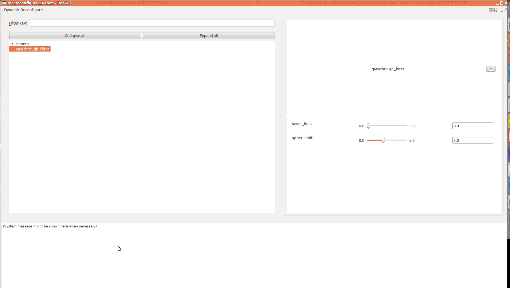
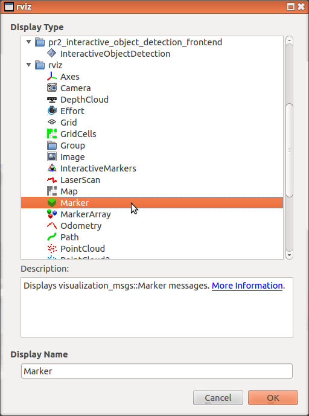

# 3D Perception with ROS and PCL
## Tutorial

### 1.  3D camera driver

In this tutorial an Asus XTion RGBD camera is used. The ROS driver is located in the package [openni_camera](http://www.ros.org/wiki/openni_camera) and the launch files in [openni_launch](http://www.ros.org/wiki/openni_launch).

#### 1.1.  Run the driver

To start the driver, run in a new terminal
```
roslaunch openni_launch openni.launch
```
To see the output topics, type
```
rostopic list
```
You should see a lot of topics starting with /camera/.

#### 1.2.  Visualize the camera data in RVIZ

To open rviz, run
```
rosrun rviz rviz
```


Click on "Add" and select "PointCloud2":


You will see the new display but no point cloud and an error message:


In order to visualize correctly, you have to choose the reference coordinate frame. In "Global Options", set "Fixed Frame" to "/camera_link". Now you can see the sensor data:


Now you can change the visualization options, such as "Style", "Size", "Alpha" and "Color Transform" in order to alter the visualizaiton appearance.

### 2.  Passthrough filter

Now we add a passthrough filter in order to crop the background of the point cloud.

#### 2.1.  Run the filter

Go to the pcl_tutorial package
```
roscd pcl_tutorial
```
and check the launch file
```
gedit launch/passthrough_filter.launch
```
You can observe, that the line <remap from="point_cloud_in" to="/camera/depth_registered/points"/> remaps the input topic to the colored point cloud of the openni node. Also, you can see the default values for the parameters. Use the command
```
roslaunch pcl_tutorial passthrough_filter.launch
```
to run the filter. In RVIZ, you can change the topic name in the PointCloud2 display to see the cropped point cloud. To lookup the topic, type
```
rostopic list | grep passthrough
```

#### 2.2.  Configure parameters

Now we configure the parameters of the passthrough filter using [dynamic reconfigure](http://wiki.ros.org/rqt_reconfigure). Type
```
rosrun rqt_reconfigure rqt_reconfigure
```
to open the GUI. Select "passthrough_filter". Now you can change the upper and lower limit of the filter. The parameters specify limits of the depth values.



### 3.  Plane segmentation

#### 3.1.  Run the segmentation

The next step is to start the plane segmentation, using
```
roslaunch pcl_tutorial plane_segmentation.launch
```
The node will find the dominant plane in the point cloud and output markers for the centroid and the normal of the plane. It will also output the inliers of the plane (/plane_segmentation/point_cloud_out) and the remainder of the scene (/plane_segmentation/point_cloud_out_2) as point cloud  

#### 3.2. Visualize the marker

In RVIZ, click on "Add" and select "Marker":



Change the marker topic to "/marker". You should see a sphere and an arrow marker for the plane now:


### 4.  Voxel filter (optional)

In the terminal for the plane segmentation, you can see the processing time which is quite long. In order to speed up the computation we are going to add a voxel filter as pre-processing step.

#### 4.1. Configure the launch files

The voxel filter should be added as a first processing step. Thus, you have to modify the launch file for the passthrough filter so that it is connected to the output of the voxel filter. Use ROS tools like rostopic or rxgraph to find out how to change the launch file.

#### 4.2. Run the voxel filter

Now you can run the filter node by
```
roslaunch pcl_tutorial voxel_filter.launch
```
You can change the leaf size parameters of the node using dynamic reconfigure.

#### 4.3. Check the results

In console, observe the computation time of the plane segmentation if you change the parameters of the voxel filter. Also, visualize the downsampled point cloud in RVIZ.
